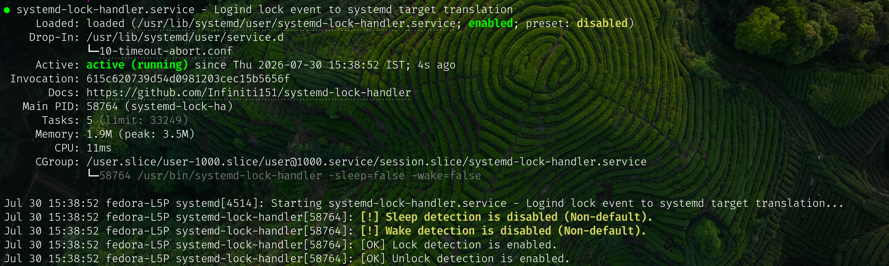

systemd-lock-handler
====================

[](https://github.com/Infiniti151/systemd-lock-handler/actions/workflows/build.yml) [](https://copr.fedorainfracloud.org/coprs/infiniti151/systemd-lock-handler/package/systemd-lock-handler/) [](https://github.com/Infiniti151/systemd-lock-handler/releases) [](https://github.com/Infiniti151/systemd-lock-handler/releases) [](go.mod) [](https://github.com/Infiniti151/systemd-lock-handler/releases/latest/download/public.key) [](LICENSE)

`logind` (part of systemd) emits events when the system is locked, unlocked or
goes into sleep.

These events however, are simple D-Bus events, and don't actually run anything.
There are no facilities for users to easily _run_ anything on these events
either (e.g.: a screen locker).

`systemd-lock-handler` is a small, lightweight helper fills this gap.

When the system is either locked, unlocked, or about to go into sleep, this
service will start the `lock.target`, `unlock.target` and `sleep.target`
systemd user targets respectively.

When the system is unlocked, `lock-target` will be stopped.

Any service can be configured to start with any of these targets:

- A screen locker.
- A service that keeps the screen off after 15 seconds of inactivity.
- A service that turns the volume to 0%.
- ...

Note that systemd already has a `sleep.target`, however, that's a system-level
target, and your user-level units can't rely on it. The one included in this
package does not conflict, but rather compliments that one.

Installation
------------

## 🛡️ Verified Package Installation

### Fedora
1. **Enable COPR:**
   ```bash
   sudo dnf copr enable infiniti151/systemd-lock-handler

2. **Install package:**
   ```bash
   sudo dnf install systemd-lock-handler

### Other Redhat based distros

1. **Import the public key:**
   ```bash
   curl -L https://github.com/Infiniti151/systemd-lock-handler/releases/latest/download/public.key | sudo rpm --import -

2. **Install RPM:**
   ```bash
   sudo dnf install $(curl -s https://api.github.com/repos/Infiniti151/systemd-lock-handler/releases/latest | grep "browser_download_url.*rpm" | cut -d '"' -f 4)

### Debian based distros

1. **Import the public key:**
   ```bash
   curl -L https://github.com/Infiniti151/systemd-lock-handler/releases/latest/download/public.key | gpg --dearmor | sudo tee /usr/share/keyrings/infiniti151-archive-keyring.gpg > /dev/null

2. **Install DEB:**
   ```bash
   curl -sL -o /tmp/lock-handler.deb $(curl -s https://api.github.com/repos/Infiniti151/systemd-lock-handler/releases/latest | grep "browser_download_url.*deb" | cut -d '"' -f 4) \
   && sudo apt install /tmp/lock-handler.deb \
   && rm /tmp/lock-handler.deb

## 🛠️ Manual Installation

You can manually build and install:

    git clone https://github.com/Infiniti151/systemd-lock-handler.git
    cd systemd-lock-handler
    make install

Usage
-----

The service itself must be enabled for the current user (for package installs):

    systemctl --user enable --now systemd-lock-handler.service

Additionally, service files must be created and enabled for any service that
should start when the system is locked.

For example, `enabling` this service file would run `swaylock` when `logind`
locks the session and before the system goes to sleep:

    [Unit]
    Description=Screen locker for Wayland
    # If swaylock exits cleanly, unlock the session:
    OnSuccess=unlock.target
    # When lock.target is stopped, stops this too:
    PartOf=lock.target
    # Delay lock.target until this service is ready:
    After=lock.target

    [Service]
    # systemd will consider this service started when swaylock forks...
    Type=forking
    # ... and swaylock will fork only after it has locked the screen.
    ExecStart=/usr/bin/swaylock -f
    # If swaylock crashes, always restart it immediately:
    Restart=on-failure
    RestartSec=0

    [Install]
    WantedBy=lock.target

`PartOf=lock.target`: Use this for services that must stop the moment you unlock your screen, such as a "Do Not Disturb" mode or a script that pauses background syncs while you are away.

`PartOf=sleep.target`: Use this for services that must stop exactly when the system resumes, ensuring that "waking up" cleanup scripts (like ExecStop) fire the moment the hardware resumes.

`WantedBy=lock.target`: Use this for services that should start whenever the session becomes "In-Active" (the screen locks), such as darkening keyboard LEDs or pausing media players.

`WantedBy=unlock.target`: Use this for services that should start automatically the moment you unlock your screen, such as a script that re-enables your dGPU, refreshes your mail, or resumes background notifications.

`WantedBy=sleep.target`: Use this for services that should only trigger during the transition to suspend, such as disabling a power-hungry peripheral or saving system state just before the kernel pauses.

Automatic Cleanup: Unlike standard user targets, `sleep.target` is explicitly stopped by the handler upon resume. Services tied to it will run their `ExecStop` as soon as the system is resumed.

## Locking

Lock your session using `loginctl lock-session`.

This will mark the session as locked, and start `lock.target` along with any
services that are `WantedBy` it.

## Unlocking

Unlock your session using `loginctl unlock-session`.

This will mark the session as unlocked, start `unlock.target`, and stop
`lock.target`. 

Service that are marked `PartOf=lock.target` will be stopped when `lock.target`
stops.

## Suspending

Sleep your device using `systemctl suspend`.

This will start `sleep.target` along with any services that are `WantedBy` it.
This will happen _before_ the system is suspended.

## Detection Toggling

Be default, detection for all events (sleep, lock, and unlock) is enabled. This detection can be toggled individually via flags. These flags need to be added using a systemd drop-in file.

| Flags | Function | Default |
| :--- | :----: | :----: |
| sleep | Suspend/resume detection (sleep.target) | true |
| lock | Lock detection (lock.target) | true |
| unlock | Unlock detection (unlock.target) | true |
| block-sleep-lock | Filter out lock/unlock events caused by suspend/resume | false |

**Example of sleep detection turned off and sleep-lock filtering turned on:**

Add flags using `systemctl --user edit systemd-lock-handler.service`
```
[Service]
ExecStart=
ExecStart=/usr/bin/systemd-lock-handler -sleep=false -block-sleep-lock=true
```

Reload the daemon and restart the service:
```
systemctl --user daemon-reload
systemctl --user restart systemd-lock-handler
```

The detection status for all three events is shown in the service status (```systemctl --user status systemd-lock-handler```):

